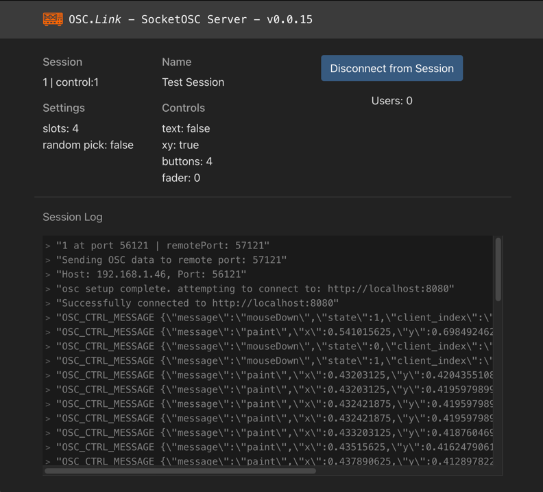
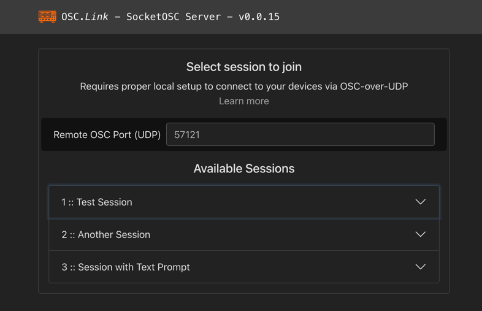

# OSC.LINK
_______________

OSC.LINK is a control interface for realtime interaction between a mobile or desktop browser, and the OSC protocol. It was designed for the rapid-prototyping of multi-user media installations, and simple extensible deployment for mobile phone interaction without the cumbersome steps of joining a network, downloading an app, or signing up for an account.

By snapping a QR code or following a simple URL, user mobile devices are turned into input controllers that can send active and passive interaction data to a local client, and then fed to any platform that can recieve OSC, such as game engines, DAWs or media servers

 

___________

### Quickstart:
- Head to the [releases](https://github.com/laubsauger/socketosc/releases) page and download the latest platform specific build for your system
- Launch the app and join an available session from the list
- Configure your destination application to listen to localhost IP(127.0.0.1), on specified port and IP
- Interaction data from users that join this session from [osc.link](https://osc.link) will now be sent over UDP to the target destination

______________

### Known Issues:
- [ ] buttons send both the true and false messages at the same time, only on button release. seems to work as expected on desktop browser

_____________________

### TO DO / RFE wishlist:
- [ ] add Join Random slot button, or make it so that Random:True servers only have one full sized button to join a slot
- [ ] ability to host multiple local sessions, with per session IP/port configuration. checkboxes instead of joining a specific server
- [ ] hostside configuration for external IP beyond hardcoded localhosst
- [ ] host side dashboard for quick visual feedback to see number of slots/connections, indicate activity
~~- [ ] ability to draw off the panel on desktopBrowser 2d pad, i.e. get clamped value based on local windows position not browser panel~~

_________________
### Future Roadmap:
- implement user credential system for private sessions
- implement admin dashboard for creation and customization of hosted sessions, with Name/Label attributes for each parameter, and a variety of parameter data types
  - button (momentary, toggle and radio type)
  - knob (min / max attributes, endless option, vertical/horz control option)
  - fader (min / max attributes, endless option, vertical/horz control option)
  - 2d pad
  - string float (optional submission button to send the string as a value)
  - dropdown menu
  - colorPicker (thumbnail with popup wheel or RGB/HSB faders)
- Enable passive data from mobile users such as GPS, accelerometer/gyro, roll/tilt/yaw

____________
### Changelog

#### [v.0.0.15] 2022-10-15
- [x] a script disables dragging for the browser when an osc.link  server is joined
- [x] On mobile, y value is the full height of the phone screen, not true UV of the panel. this is the cause of some of the issues below
- [x] wide aspect browser windows on desktop are unable to reach the bottom of the float thrange on the Y axis of 2d control
- [x] Y gets distorted/cropped in landscape (same issue ^^^), under buttons
- [x] reverse sorted logging or adjustable limit of console readout for host feedback / FIFO

#### [v.0.0.14] 2022-10-8
- [x] Depricate "Disco Diffusion" branch from hamburger menu and publish String field parameter instead as data type
- [x] hostside configuration for Port instead of hardcoded destination
- [x] "Made by Laubsauger | Powered by socketosc" text needs to be offset with a depth layer behind the UI to avoid space collision conflicts. Currently the second session can't be joined from mobile on iphone13Pro for this reason  (fine on larger screen android), and the conflict is present in Chrome browser, but can be scaled around
- [x] host side option to end a session and open a new session, instead of quitting application to join a new session
_______

### Credits:
built and maintained by [Laubsauger](https://github.com/laubsauger)

conception/direction: [DRMBT](https://github.com/drmbt)

prototype forked from [ThorneBrandt](https://github.com/thornebrandt)
